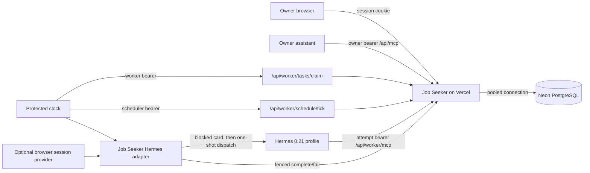

# Complete Neon, Vercel, and Hermes reference stack

This is a sanitized, copyable version of the hosted Job Seeker topology that was
reviewed during the public extraction. It connects one Job Seeker deployment to
one Neon database, one Vercel project, one restricted Hermes profile, and the
repository's portable worker adapter. It contains no real account names, project IDs,
deployment URLs, provider credentials, candidate data, or browser session data.

The generated files live in [`examples/reference-stack`](../examples/reference-stack/README.md).
Run the renderer rather than copying secret-bearing snippets from this page.



The app owns schedules, queued tasks, leases, checkpoints, results, CVs, and job
records. The reusable worker token can claim work but never enters the model.
After a claim, the app issues a short-lived attempt capability. The adapter binds
that capability to the selected Hermes card and only that capability reaches the
restricted task MCP endpoint. An empty queue starts no Hermes process and makes
no model call.

## Exact authority boundaries

| Credential | Stored at | Accepted by | Never give it to |
| --- | --- | --- | --- |
| Login password hash and session secret | Vercel production environment | Browser login/session code | Worker or Hermes profile |
| `OWNER_MCP_TOKEN` | Vercel and the owner's interactive MCP client | `/api/mcp` | Worker, scheduler, or task model |
| Worker token | Vercel registration plus an owner-only file on the worker host | Claim/lease/result worker routes | Scheduler, profile, card, or model prompt |
| Scheduler token | Vercel plus a different owner-only file on the worker host | `/api/worker/schedule/tick` | Worker or model |
| Attempt capability | Memory for one claimed attempt | That task's worker routes and `/api/worker/mcp` | Files, reusable configuration, or another attempt |
| Model/provider authentication | Hermes' supported private authentication store | Hermes/model provider | Job Seeker or Vercel |
| Optional Browser Use key and profile ID | Protected worker configuration | Browser Use API | Vercel or model prompt |

Generate independent random owner, worker, scheduler, and session values. Earlier
private deployments derived worker credentials from a shared seed for migration
compatibility. This reference deliberately uses independent values.

## Versions and external prerequisites

The reviewed reference baseline was:

- Job Seeker worker package and protocol `0.1.0` / `1`;
- Node.js 22 for Vercel and Node.js 22–24 for local tools;
- Python 3.11 or newer for the worker;
- Vercel CLI 58.7.1; and
- an unmodified upstream Hermes 0.21.0 runtime with its own working model login.

Install Neon and Vercel accounts and CLIs, a PostgreSQL client if you want manual
database inspection, Python's `venv` support, and systemd on the worker host.
The pinned Hermes install also uses [uv](https://docs.astral.sh/uv/getting-started/installation/);
make its executable available to the service account (for example, in `/usr/local/bin`). Pin
and review the exact Hermes release you operate. This repository supplies the
Job Seeker adapter and guarded launcher; it does not redistribute Hermes, create
a provider account, or supply provider credentials.

Use a dedicated Linux service account. The example layout is:

```text
/opt/job-seeker/source                     immutable Job Seeker checkout
/opt/job-seeker/venv                       installed worker wheel
/opt/job-seeker/bin/job_seeker_clock.py    generated clock
/opt/hermes/source                         reviewed Hermes source
/opt/hermes/source/venv/bin/hermes         matching Hermes executable
/etc/job-seeker/worker.env                 protected non-owner worker settings
/etc/job-seeker/scheduler.env              protected scheduler settings
/var/lib/job-seeker/secrets/{worker,scheduler}-token
/var/lib/job-seeker/.hermes/config.yaml    Hermes root configuration
/var/lib/job-seeker/.hermes/profiles/job-seeker-worker/config.yaml
/var/lib/job-seeker/.hermes/kanban         writable Hermes/Kanban state
```

Keep `/etc/hermes/config.yaml` absent. The guarded launcher rejects that managed
root path because an unrelated native secret map could otherwise be loaded before
the attempt gate. Also keep `.env`, `.op.env`, and managed dotenv fallbacks absent
or comment-only under the Hermes source, service home, and managed configuration
locations. Put model authentication only in the exact Hermes release's supported
private auth store.

Start from an exact source revision and install the JavaScript dependencies
before running any repository command:

```sh
export JOB_SEEKER_REVISION=0123456789abcdef0123456789abcdef01234567
sudo install -d -o "$(id -un)" -g "$(id -gn)" -m 755 /opt/job-seeker
git clone https://github.com/danibendi/job-seeker.git /opt/job-seeker/source
git -C /opt/job-seeker/source checkout --detach "$JOB_SEEKER_REVISION"
test "$(git -C /opt/job-seeker/source rev-parse HEAD)" = "$JOB_SEEKER_REVISION"
cd /opt/job-seeker/source
npm ci
```

Replace the synthetic revision with the reviewed full commit SHA. The same
checkout is used for migrations, the Vercel allowlist, the worker wheel, and the
Hermes readiness checker.

## 1. Create Neon and the protected inputs

Create a Neon project in `aws-eu-central-1` and a database named `job_seeker`, or
choose another region and update this reference and Vercel region together. Use
an isolated branch for rehearsal. Record the branch ID so cleanup cannot target a
different branch.

Fetch both connection strings without displaying or storing them in shell
history. Replace the non-secret IDs and role name first:

```sh
sudo install -d -o root -g root -m 755 /protected
sudo install -d -o "$(id -un)" -g "$(id -gn)" -m 700 \
  /protected/job-seeker /protected/job-seeker/secrets
umask 077
neonctl connection-string "$NEON_BRANCH_ID" \
  --project-id "$NEON_PROJECT_ID" --database-name job_seeker \
  --role-name "$NEON_ROLE" --pooled --ssl require \
  > /protected/job-seeker/secrets/database-pooled
neonctl connection-string "$NEON_BRANCH_ID" \
  --project-id "$NEON_PROJECT_ID" --database-name job_seeker \
  --role-name "$NEON_ROLE" --ssl require \
  > /protected/job-seeker/secrets/database-direct
chmod 600 /protected/job-seeker/secrets/database-*
```

The renderer normalizes the `-pooler` host and refuses a pooled/direct pair whose
endpoint, role, password, port, or database differs. That prevents migrations
from silently targeting a different database than the deployed app.

Create a protected login password file, then let Job Seeker's setup command
generate the bcrypt hash, session secret, and owner token without printing them:

```sh
umask 077
read -r -s -p 'Job Seeker login password: ' JOB_SEEKER_PASSWORD
printf '\n'
printf '%s' "$JOB_SEEKER_PASSWORD" > /protected/job-seeker/secrets/login-password
unset JOB_SEEKER_PASSWORD

DATABASE_URL="$(cat /protected/job-seeker/secrets/database-pooled)" \
DATABASE_URL_UNPOOLED="$(cat /protected/job-seeker/secrets/database-direct)" \
npm run setup -- \
  --env-file /protected/job-seeker/secrets/bootstrap.env \
  --password-file /protected/job-seeker/secrets/login-password \
  --with-owner-mcp --skip-migrate
```

Split the generated values into the files expected by the renderer. The setup
file uses dotenv escaping and is not safe to source as shell. This Node command
uses the repository's own parser and never prints a value:

```sh
node --input-type=module <<'NODE'
import { readFile, writeFile } from "node:fs/promises";
import { join } from "node:path";
import { parseEnvFile } from "./scripts/lib/env-file.mjs";
const directory = "/protected/job-seeker/secrets";
const values = parseEnvFile(await readFile(join(directory, "bootstrap.env"), "utf8"));
for (const [name, file] of [
  ["AUTH_PASSWORD_HASH", "auth-password-hash"],
  ["SESSION_SECRET", "session-secret"],
  ["OWNER_MCP_TOKEN", "owner-mcp-token"],
]) {
  if (!values[name] || /[\r\n]/.test(values[name])) throw new Error(`invalid ${name}`);
  await writeFile(join(directory, file), values[name] + "\n", { mode: 0o600, flag: "wx" });
}
NODE
openssl rand -hex 32 > /protected/job-seeker/secrets/worker-token
openssl rand -hex 32 > /protected/job-seeker/secrets/scheduler-token
chmod 600 /protected/job-seeker/secrets/*
rm /protected/job-seeker/secrets/login-password /protected/job-seeker/secrets/bootstrap.env
```

## 2. Configure and render the stack

Copy the synthetic configuration outside the checkout and edit every deployment
choice. Use a unique Vercel project name. `vercel.accountId` is the Vercel team
ID, including a Hobby team, and `vercel.scope` is that team's CLI slug; obtain
both from the team settings. Set `sourceRevision`
to the exact reviewed Git commit and set `appUrl` to the final credential-free
HTTPS origin. Origins with a path, query, fragment, or embedded credentials are
rejected.

```sh
umask 077
cp examples/reference-stack/stack.example.json /protected/job-seeker/stack.json
python3 examples/reference-stack/render.py \
  --config /protected/job-seeker/stack.json
python3 examples/reference-stack/render.py \
  --config /protected/job-seeker/stack.json \
  --write --output /protected/job-seeker/generated
python3 examples/reference-stack/render.py \
  --check-generated /protected/job-seeker/generated
```

Dry-run is the default. It validates structure without reading secret files or
writing output. Write mode refuses an existing output directory, reads only
owner-only regular files, and writes mode-0600/0700 artifacts. It never prints
secret contents. Rerender into a new directory after any configuration change. For an update to
the same Vercel project, retain its protected `vercel-project.json` ownership
record and copy it with mode `0600` into the new output directory. The deploy
and cleanup helpers verify that record against the configured team and project;
never reuse it for another deployment.

`app.env` uses shell quoting because the deployment script sources it and streams
each value to Vercel. Do not copy it to `.env.local`: Next dotenv expansion can
reinterpret dollar signs in bcrypt hashes. For local Next environments, continue
to use `npm run setup`, whose env writer escapes values for Next.

## 3. Migrate and deploy Vercel

Apply all migrations from the trusted checkout before deployment. Source the
generated shell file rather than asking a dotenv parser to reinterpret it:

```sh
set -a
. /protected/job-seeker/generated/app.env
set +a
npm ci
npm run db:migrate
unset DATABASE_URL DATABASE_URL_UNPOOLED AUTH_PASSWORD_HASH SESSION_SECRET \
  OWNER_MCP_TOKEN COMPASS_WORKERS_JSON COMPASS_SCHEDULER_TOKEN JOB_SEEKER_SOURCE_REVISION
```

Supply `VERCEL_TOKEN` through your secret manager and run:

```sh
/protected/job-seeker/generated/deploy-vercel.sh
```

The script scopes every API and CLI request to the configured account, creates a
local mode-0600 ownership record on first creation, and refuses an existing
same-name project without that matching record. It explicitly asserts Next.js,
Node 22, and the configured function region (`fra1` in the tested example); a CLI-created project without the Next.js preset can deploy
a plain 404. It uploads an allowlisted snapshot of public application sources and
configuration from `sourceRoot`, excluding `.git`, `node_modules`, parent files,
generated output, and secrets. Vercel CLI reads `VERCEL_TOKEN` from the process
environment; the token is never placed in an argument or file.

The deployment script also refuses a dirty allowlisted source tree or a Git HEAD
that differs from `sourceRevision`, then verifies the exact configured origin's
health response and revision after deployment.

Open `/login`, sign in, and complete `/onboarding`. A new database contains no
person and automation is disabled. Enter the real profile only through onboarding,
then add CVs and preferences in the app. Do not enable a schedule yet.

Verify health, login, desktop and phone navigation, invalid owner bearer rejection,
and authenticated owner MCP initialization:

```sh
set -a
. /protected/job-seeker/generated/app.env
set +a
npm run verify:setup -- --env-file /dev/null --url https://jobs.example.net
unset DATABASE_URL DATABASE_URL_UNPOOLED AUTH_PASSWORD_HASH SESSION_SECRET \
  OWNER_MCP_TOKEN COMPASS_WORKERS_JSON COMPASS_SCHEDULER_TOKEN JOB_SEEKER_SOURCE_REVISION
```

`owner-mcp-client.yaml` is a copyable fragment for an existing interactive owner
Hermes profile. Merge it into that profile, then load the token only into that
interactive runtime before launch:

```sh
export JOB_SEEKER_OWNER_MCP_TOKEN="$(cat /protected/job-seeker/secrets/owner-mcp-token)"
exec /path/to/interactive-owner-hermes
```

This client uses `https://jobs.example.net/api/mcp`. It is separate from the
service account and restricted worker profile, which use a short-lived attempt
token at `/api/worker/mcp`. Never put the owner token in worker configuration.

## 4. Build and install the worker artifact

Build the wheel from the same reviewed revision and record its digest:

```sh
python3 -m venv /tmp/job-seeker-build
/tmp/job-seeker-build/bin/pip install build 'setuptools>=77' wheel
SOURCE_DATE_EPOCH=1704067200 /tmp/job-seeker-build/bin/python -m build --wheel --no-isolation
sha256sum dist/job_seeker_worker-0.1.0-py3-none-any.whl
```

On the worker host, install the built wheel as root, then make the checkout,
virtual environment, and clock root-owned and read-only to the service account.
Only `/var/lib/job-seeker` is writable by `job-seeker`. Adapt `sudo` to the
host's operator workflow:

```sh
cd /tmp
sudo useradd --system --home-dir /var/lib/job-seeker --create-home --shell /usr/sbin/nologin job-seeker
sudo install -d -o root -g root -m 755 /opt/job-seeker/bin
sudo python3 -m venv /opt/job-seeker/venv
sudo /opt/job-seeker/venv/bin/pip install \
  '/opt/job-seeker/source/dist/job_seeker_worker-0.1.0-py3-none-any.whl[hermes]'
sudo chown -R root:job-seeker /opt/job-seeker/source /opt/job-seeker/venv
sudo chmod -R u=rwX,g=rX,o= /opt/job-seeker/source /opt/job-seeker/venv
sudo chown root:job-seeker /opt/job-seeker
sudo chmod 750 /opt/job-seeker
sudo install -o root -g job-seeker -m 750 \
  /protected/job-seeker/generated/job_seeker_clock.py \
  /opt/job-seeker/bin/job_seeker_clock.py
sudo install -d -o root -g job-seeker -m 750 /etc/job-seeker
sudo install -d -o job-seeker -g job-seeker -m 700 /var/lib/job-seeker/secrets
sudo install -o job-seeker -g job-seeker -m 400 \
  /protected/job-seeker/generated/worker.env /etc/job-seeker/worker.env
sudo install -o job-seeker -g job-seeker -m 400 \
  /protected/job-seeker/generated/scheduler.env /etc/job-seeker/scheduler.env
sudo install -o job-seeker -g job-seeker -m 600 \
  /protected/job-seeker/secrets/worker-token /var/lib/job-seeker/secrets/worker-token
sudo install -o job-seeker -g job-seeker -m 600 \
  /protected/job-seeker/secrets/scheduler-token /var/lib/job-seeker/secrets/scheduler-token
```

The environment files are readable only by the service account and installed
inside a root-owned directory. The systemd unit mounts `/etc` read-only; the
clock rejects group-readable environment files. Keep private authentication
files outside the source and virtual-environment trees before setting code
permissions.

Use the actual wheel path in the `pip install` command. Verify its SHA-256 against
the build record and run `/opt/job-seeker/venv/bin/job-seeker-worker --help`.

## 5. Install the restricted Hermes profile

Install the reviewed upstream Hermes release from its
[official repository](https://github.com/NousResearch/hermes-agent) and follow
the [official installation guide](https://hermes-agent.nousresearch.com/docs/).
The reviewed baseline was tag `v2026.8.31` at commit
`29112bef099274229cadff79cdff7bf7b99c4b77`. Place its source and virtual
environment so the executable is exactly `runtimeRoot/venv/bin/hermes`:

```sh
sudo install -d -o job-seeker -g job-seeker -m 755 /opt/hermes
sudo -u job-seeker git clone --branch v2026.8.31 --depth 1 \
  https://github.com/NousResearch/hermes-agent.git /opt/hermes/source
test "$(sudo -u job-seeker git -C /opt/hermes/source rev-parse HEAD)" = \
  29112bef099274229cadff79cdff7bf7b99c4b77
sudo -u job-seeker env UV_PROJECT_ENVIRONMENT=/opt/hermes/source/venv \
  uv --directory /opt/hermes/source sync --extra all --locked --no-dev
test -x /opt/hermes/source/venv/bin/hermes
sudo install -d -o job-seeker -g job-seeker -m 700 /var/lib/job-seeker/.hermes
sudo chown -R root:job-seeker /opt/hermes
sudo chmod -R u=rwX,g=rX,o= /opt/hermes
```

This reference cannot copy an account credential or subscription session. Model
authentication is added after the generated root fragment so Hermes preserves
both its own provider state and the required Kanban setting.

The generated profile allows only the Job Seeker task MCP and Hermes' public web
toolset. It disables shell, code execution, files, memory, delegation, scheduling,
unrelated plugins, browser CDP, and secret-manager plugins. The task MCP header
uses `${COMPASS_TASK_TOKEN}`, which exists only in the claimed child process.

Install the profile and root configuration in the private `HERMES_HOME` layout:

```sh
sudo install -d -o job-seeker -g job-seeker -m 700 \
  /var/lib/job-seeker/.hermes/profiles/job-seeker-worker \
  /var/lib/job-seeker/.hermes/kanban
sudo install -o job-seeker -g job-seeker -m 600 \
  /protected/job-seeker/generated/hermes-profile.yaml \
  /var/lib/job-seeker/.hermes/profiles/job-seeker-worker/config.yaml
sudo install -o job-seeker -g job-seeker -m 600 \
  /protected/job-seeker/generated/hermes-root-config.yaml \
  /var/lib/job-seeker/.hermes/config.yaml
sudo -u job-seeker env HOME=/var/lib/job-seeker \
  HERMES_HOME=/var/lib/job-seeker/.hermes \
  /opt/hermes/source/venv/bin/hermes model
```

If the pinned release already has root/profile configuration, merge these keys
through its reviewed operator workflow rather than replacing unrelated required
keys. The effective root and profile must retain
`kanban.dispatch_in_gateway: false`; only the adapter may dispatch this reserved
board. The derived `job-seeker-worker-staging` profile must not exist.
Use the [official provider guide](https://hermes-agent.nousresearch.com/docs/integrations/providers)
for the interactive `hermes model` choice and confirm the resulting provider and
model still match the generated restricted profile.

Run the file-level check and the installed worker's local configuration check:

```sh
sudo -u job-seeker /opt/job-seeker/venv/bin/python \
  /opt/job-seeker/source/ops/hermes/check-readiness.py \
  --profiles-dir /var/lib/job-seeker/.hermes/profiles \
  --profile job-seeker-worker \
  --staging-profile job-seeker-worker-staging \
  --root-config /var/lib/job-seeker/.hermes/config.yaml

sudo -u job-seeker /opt/job-seeker/venv/bin/python \
  /opt/job-seeker/bin/job_seeker_clock.py --check-config

sudo -u job-seeker sh -c '
  set -a
  . /etc/job-seeker/worker.env
  set +a
  export PATH=/opt/job-seeker/venv/bin:/usr/local/bin:/usr/bin:/bin
  exec /opt/job-seeker/venv/bin/job-seeker-worker --check --json
'
```

These checks make no model call. They prove file, staging, and local adapter
configuration only. They do not prove network authentication or a completed task.

## 6. Exercise one real task, then enable the clock

In **Settings → Schedule and execution**, set **Searches and questions** to
**Hermes** and save it. Keep the recurring schedule disabled and leave discovery
sources disabled for this first question. The fresh default is **Choose later —
keep queued**; a Hermes worker cannot claim an unassigned question.

Submit a harmless question through the browser. Run the clock once manually:

```sh
sudo -u job-seeker /opt/job-seeker/venv/bin/python \
  /opt/job-seeker/bin/job_seeker_clock.py
```

Confirm all of the following in the app and Hermes state:

1. the app task changed from queued to running before Hermes started;
2. its card first used the absent staging assignee and was blocked;
3. the app retained the external execution reference before the real profile was assigned;
4. only the attempt capability reached `/api/worker/mcp`;
5. the answer was saved to the original request; and
6. the card and app task ended in compatible terminal states.

Also test cancellation and one retry before enabling unattended work. A config
constructor or `--check` result is not evidence of this flow.

The generated clock performs one schedule tick, then calls the pinned worker
runner with `drain=True`. It accepts runnable tasks until the queue is empty or
the configured drain deadline blocks a new claim. A task already claimed keeps
its normal lease/cleanup lifecycle. `flock` prevents overlapping invocations.

For the portable service path:

```sh
sudo install -m 644 /protected/job-seeker/generated/job-seeker-clock.service \
  /etc/systemd/system/job-seeker-clock.service
sudo install -m 644 /protected/job-seeker/generated/job-seeker-clock.timer \
  /etc/systemd/system/job-seeker-clock.timer
sudo systemctl daemon-reload
sudo systemctl start job-seeker-clock.service
sudo systemctl enable --now job-seeker-clock.timer
```

The unit runs the clock with the installed virtualenv interpreter. systemd creates
the private `/run/job-seeker` lock directory and persistent `/var/lib/job-seeker`
state directory, while `ProtectSystem=strict` leaves the application, worker, and
Hermes source immutable. Only those two state paths and the private temporary
directory are writable.

Hermes 0.21 operators may instead copy the same script into that release's native
script directory and import the generated disabled `native-job.json` through the
release's reviewed job-management interface. The JSON records the exercised job
shape; upstream Hermes has no version-neutral JSON import contract. Verify the
effective job, then enable it. Do not enable both the native job and systemd timer.

Finally, configure the schedule in Job Seeker settings. The native/systemd clock
may run every 15 minutes; the app still decides whether a search is due. Empty
ticks make zero model calls.

## 7. Optional LinkedIn browser component

LinkedIn collection is off in the example. The integrated worker does not need
`LINKEDIN_COLLECTOR_TOKEN`; that token belongs to a separate external collector
endpoint. The reviewed optional path used a Browser Use persistent profile,
direct connectivity, disabled recording, media blocking, and a unique expected
account name.

Store the Browser Use key in a mode-0600 file, set `linkedin.enabled` to `true`,
and render a new output directory. Before enabling search, load the worker
configuration and create the persistent profile interactively:

```sh
sudo -u job-seeker sh -c '
  set -a
  . /etc/job-seeker/worker.env
  set +a
  exec /opt/job-seeker/venv/bin/job-seeker-linkedin-login --login --create-profile
'
```

Open the returned live URL yourself, sign in, send `probe`, and confirm the unique
expected account identity before sending `finish`. Put the returned profile ID in
the protected stack configuration, rerender, and reinstall `worker.env`. The
connector never imports or exports cookies, never solves CAPTCHAs, and turns login,
identity, access, progress, and budget failures into explicit handoffs. A loopback
CDP browser may be used through `COMPASS_LINKEDIN_CDP_URL`; non-loopback local CDP
is rejected. Review the site's terms and the browser provider's cost/retention
settings before enabling it.

## Verification record

The reference artifacts themselves were checked from an ordinary contributor
checkout with the worker package installed (`python -m pip install -e ".[test]"),
using:

```sh
python3 -m unittest discover -s examples/reference-stack/tests -v
python3 examples/reference-stack/render.py \
  --config examples/reference-stack/stack.example.json
sh -n examples/reference-stack/templates/deploy-vercel.sh
sh -n examples/reference-stack/templates/cleanup-vercel.sh
npm run privacy:scan
```

The renderer suite covers write-free dry-run, protected rendering, generated-file
checks, a rejected permissive secret file, configuration validation under the
installed worker package, and the generated clock control flow against an empty-queue fixture with stubbed
client, adapter, and runner classes. The fixture makes no network or model call;
it does not establish a live empty-queue result. All three tests passed. A production build from the deployment
script's exact source allowlist also passed with synthetic environment values;
that build made only the public Google Fonts requests already made by the app.
The app's earlier disposable Neon/Vercel and browser evidence is recorded in
[`verification-results.md`](verification-results.md). This publication check did
not install Hermes, start systemd, call a model, or use a LinkedIn account.

Record these facts without recording secret values or private data:

| Check | Required evidence |
| --- | --- |
| Database | pooled/direct identity check, migrations applied, expected source revision |
| Vercel | matching ownership record; Next.js, Node 22, configured region; `/api/health` database available |
| Browser app | login, onboarding, desktop, phone, representative job and CV |
| Owner MCP | invalid bearer 401; authenticated initialize and list-tools success |
| Worker | local check plus worker/scheduler health under their own roles |
| Hermes | staging absent, gateway dispatch off, restricted profile, real question saved |
| Scheduler | manual tick, due/not-due behavior, empty queue with zero model calls |
| Optional browser | explicit profile/account match, confirmed session stop, bounded usage |

Public web search remains exploratory unless a connector enumerates a bounded
source and persists its progress and failures. A real question proves the question
path only; it does not prove search, evaluation quality, LinkedIn, cancellation,
or retry behavior.

## Cleanup and rollback

Disable the schedule in the app first, then stop the timer and let an active task
finish or cancel it through the app so lease-fenced cleanup can run:

```sh
sudo systemctl disable --now job-seeker-clock.timer
sudo systemctl stop job-seeker-clock.service
```

Delete the Vercel project only with the generated ownership-checked script:

```sh
/protected/job-seeker/generated/cleanup-vercel.sh
```

It compares project ID, name, and account to the local protected ownership record,
deletes by ID, verifies a 404, and then removes the record. It refuses a same-name
project that it cannot prove it owns.

After exporting any required backup, delete only the recorded Neon rehearsal or
deployment branch and verify its ID is absent from `neonctl branches list`. Never
delete a project or branch selected only by a familiar display name. Revoke the
owner, worker, scheduler, Browser Use, model-provider, Neon, and Vercel credentials
that existed only for this deployment. Remove the service unit, generated output,
protected secret directory, service state, worker venv, and optional browser
profile after confirming no other deployment uses them.

For rollback, pause the timer, keep the database and current credentials, deploy
the prior reviewed source revision against a migration-compatible branch, and run
the browser, MCP, and one-task checks again before resuming the schedule.

## What is upstream and what is supplied here

| Piece | Source |
| --- | --- |
| Durable tasks, leases, schedule, owner MCP, task MCP | Job Seeker app |
| Protocol client, Hermes adapter, guarded attempt launcher, browser connector | Job Seeker worker wheel |
| Restricted profile and root fragments | This generated reference |
| Bounded multi-task clock and protected file loader | This generated reference, modeled on the reviewed private wrapper |
| Script-only native scheduling | Hermes 0.21 job runtime, or the supplied systemd fallback |
| Kanban CLI and model execution | Unmodified operator-installed Hermes |
| PostgreSQL, serverless hosting, optional cloud browser | Neon, Vercel, optional Browser Use |

The portable systemd path contains every app → scheduler tick → durable claim →
Hermes dispatch → fenced result save once the external Hermes runtime and its model
login exist. Two artifacts cannot be made credential-free or release-independent:
the upstream Hermes installation/provider login, and native-job import commands
for future Hermes versions. The reference therefore supplies an offline-validated
systemd configuration and bounded clock and leaves the native job disabled until
an operator validates it against the exact runtime. No live Hermes installation,
systemd service, cloud resource, model call, or browser account was exercised by
the reference-artifact tests.
